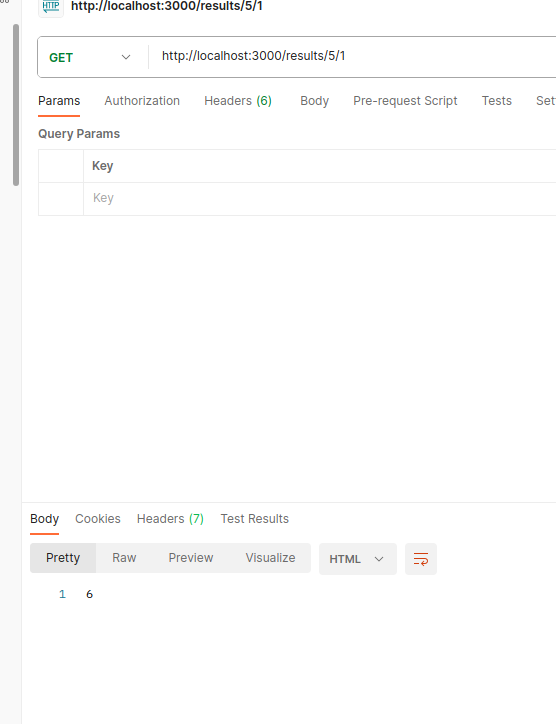

# Project Title

Tarea | Tablas RESTful

## Getting Started/ Installing

Clonar el repositorio, abrir una terminal en la raíz del repositorio y ejecutar comando(s):

`npm run dev`| `npm start`

  #### Running (in postman)

  `http://localhost:3000/results/${n1}/${n2}`
  
  `GET (suma de n1 y n2)`:
  
  

  `POST (multipicación de n1 * n2)`:
  
  
  
  `PUT (división de n1/n2)`:
  
  
  
  `PATCH (potencia de n1 ^ n2)`:
  
  
  
  `DELETE (resta n1 - n2)`:
  
  

### Prerequisites

* node js
* npm
* postman

### And coding style tests

Estilo de escritura camelCase recomendado para java script.

## Built With

* Nodejs v12.22.9 --> Entorno en tiempo de ejecución multiplataforma.
* JavaScript --> Lenguaje de programación.
* Express js
* Supervisor

## Contributing

No contribuyentes.

## Versioning

v0.0.0

## Author

Marcos Alfredo Aguilar Mata.

## License

ISC.

